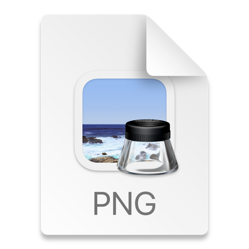

# XDialog - Flutter Custom Dialog Package

A feature-rich, highly customizable dialog package for Flutter applications.

## 🚀 Features

- 🎨 **Fully Customizable UI** – Modify colors, fonts, and layouts.
- ⚡ **Smooth Animations** – Built-in transitions for a better UX.
- 🖱️ **Hover Effects** – Interactive UI elements.
- 🌈 **Multiple Button Support** – Add as many actions as needed.
- 🎚️ **Size Customization** – Adjust width, height, and padding.
- 🕒 **Animation Control** – Customize animation duration & style.
- 🎮 **Interactive Examples** – Ready-to-use examples for quick setup.

---

## 📦 Installation

Add the dependency in your `pubspec.yaml`:

```yaml
dependencies:
  xdialog: ^1.0.0
```

Then, run:

```sh
flutter pub get
```

---

## 🎯 Usage

### 📝 Basic Dialog

To display a simple confirmation dialog:

```dart
import 'package:flutter/material.dart';
import 'package:xdialog/xdialog.dart';

void showBasicDialog(BuildContext context) {
  XDialog.show(
    context: context,
    title: const Text('Confirmation'),
    message: const Text('Are you sure?'),
    positiveButtonText: 'Yes',
    negativeButtonText: 'No',
  );
}
```

---

### 🖼️ Dialog with Image

```dart
import 'package:flutter/material.dart';
import 'package:xdialog/xdialog.dart';

void showImageDialog(BuildContext context) {
  XDialog.show(
    context: context,
    title: const Text('Image Preview'),
    message: const Text('This is an example with an image.'),
    image: Image.network('https://via.placeholder.com/150'),
    positiveButtonText: 'OK',
  );
}
```

---

## 📸 Example UI Preview

### Basic Confirmation Dialog



---

## 🎛️ Customization

### Adjust Dialog Size

```dart
XDialog.show(
  context: context,
  title: const Text('Custom Size'),
  message: const Text('You can control the size.'),
  width: 300,
  height: 200,
);
```

### Customize Button Styles

```dart
XDialog.show(
  context: context,
  title: const Text('Styled Buttons'),
  message: const Text('Different button styles.'),
  positiveButtonText: 'Confirm',
  negativeButtonText: 'Cancel',
  positiveButtonStyle: ElevatedButton.styleFrom(backgroundColor: Colors.green),
  negativeButtonStyle: TextButton.styleFrom(foregroundColor: Colors.red),
);
```

---

## 🔥 Roadmap

- [ ] Add dark mode support.
- [ ] Support for icon-based buttons.
- [ ] More transition effects.

---

## 📜 License

This project is licensed under the MIT License.

---

## 💡 Contributing

Feel free to submit pull requests or open issues for suggestions and improvements.

Happy coding! 🚀